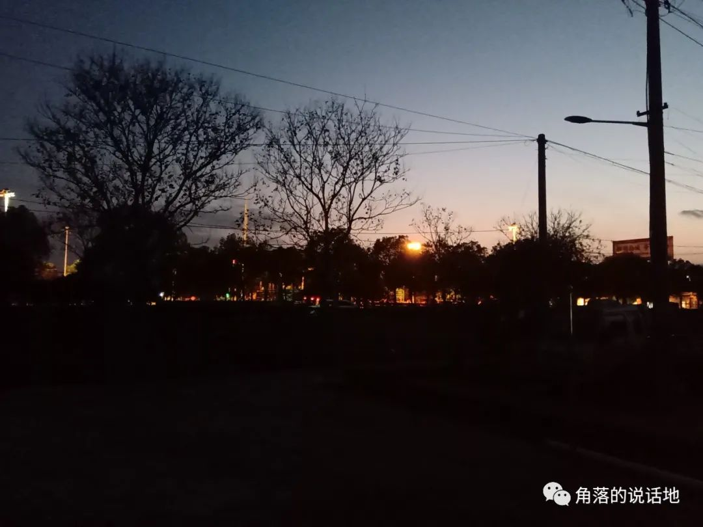

笔者通过艺考考上了一个普通的师范院校，专业是广播电视编导，选择这个专业的原因也很简单——艺考容易，笔者是2018届的江苏高考考生，此时高考还实行着“3+2”考试制度，具体来说能不能考上一个学校，既要看3门主科（即语数外）的总分，也要达到每个学校选修科目的等级要求（以ABC划分），笔者在高二文理分科时选择了理科，在理科的选修组合中选择了物理和化学。而问题也几乎从此开始。笔者由于在重点中学，身边的同学都算优秀，但又常常给自己定下较高的目标，导致自己达不到，因此身心疲惫，产生了厌学的心理，逐渐自暴自弃，直达某一天，班主任那边传出了一个编导生走艺考上大学的路径，这样就无需再继续学习选修科目，同等层次学校的语数外总分要求也低很多，于是笔者毫不犹豫的就去了。这样一场用四年都无法弥补的悲剧开始了……

<!-- truncate -->

进入大学后，笔者渐渐发现自己完全不适合艺术和编导，面对别人的自信幽默与勇于表达，自己完全就是个木讷和社恐的人，当别人可以在类型节目课分析最近看的综艺节目、在播音主持课上台歌唱表演自己的小品、在影视作品评论课对电影侃侃而谈，笔者发现自己不仅从来不看综艺，五音不全，也并不是很善于表达的人，并且对这些也完全不感兴趣。在拍摄纪录片和剧情片时，笔者对于镜头完全没有自己的想法，也不知道如何和其他人沟通，往往在拍摄时有一个充当导演的核心人员，他们往往可以从零带领大家开始一项工作，联系演员，准备道具，构思脚本和文案。在他们身上笔者似乎看到了自己永远无法弥补创造力、领导力、社交力以及对传媒行业的热爱。

就这样笔者每天都生活在一种无力感中，深陷泥潭，但同时笔者也并不想完全躺平，一直思考自己是个什么样的人，究竟应该到底去干什么。某个时间点，笔者了解到了小镇做题家，了解到了豆瓣的985five小组，感觉自己找到了同类。当然说自己是做题家确实不够格，毕竟笔者只考了一个普通一本，但至少笔者有着相同的做题家思维，笔者从大一就拼命地想办法将四级考到了640分，一直因此沾沾自喜，后面也盲目地去考计算机、教师等等证书。最重要的是那时笔者了解到了小镇做题家的白月光专业-计算机。心中存在的考计算机的模糊想法越发变得格外强烈和明显。终于，在一年前的寒假，内心极度挣扎的笔者，随着考研时限的不断逼近，终于在反复横跳中放弃了数字媒体艺术和数字媒体技术的备选项，还是选择了计算机。

