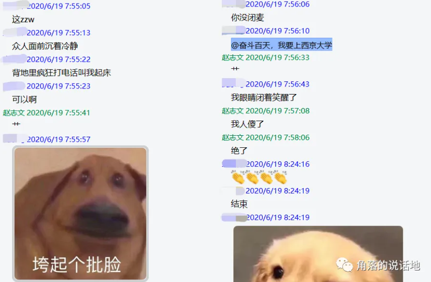
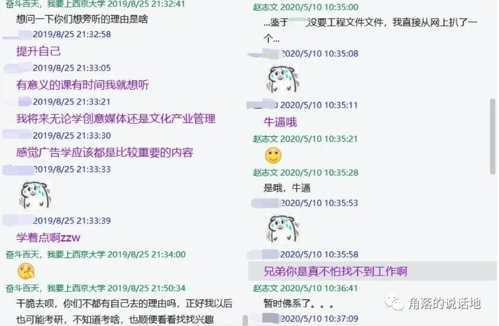

2022年7月6日20点39分，距离研究生考试，时间过去了197天，毕业过去了23天。下午收到了EMS的短信，研究生的录取通知书也预计7月9日送达。对我来说，明确的、无疑的，我的一个人生阶段是完完全全、彻彻底底地结束了。

<!-- truncate -->

其实我也不知道说些什么，可是总感觉又有很多想说的，比如时间真的过的好快，每隔一段时间我都有一瞬间恍如隔世的感觉，原来昨天已经是过去了吗？今年的3月份，由于一些原因我早早地回到了学校，那时在偌大的校园中，随着学生逐渐返校，人群变得越来越稠密，我总感觉自己好孤独，怀念起以前和好友一起的日子，于是在6月份久别重逢的的时候，我是很高兴的，而现在那段仍然历历在目的重逢也变成了过去，并且快速离我而去。

在夜深人静的夜晚，做着连接过去却又完全陌生的梦，一个人扒着和好友间几年前的聊天记录和照片，试图想起什么，回忆起什么，但结果是令人失望的，其实好像并没有发生什么，甚至有时候对话平淡地起不了一点波澜，但在这其中可能发生了在我现在看来每个人不同的改变。

整个大一，聊天记录中出现最多的还是今天有没有课，老师点不点名，去不去上课，谁去占座位、期末临时抱佛脚才讨论的学术问题以及成绩出来后大家的排名。

大二，终于有了机会一起出去住，可以说那可能是我感觉时间过得最快的欢乐时光，以至于竟都没什么实感，大家第一次合租，有着磨合、牺牲（在这里感谢YYW同学主动一个人睡了客厅，很抱歉每次深夜去厕所看见你熟睡的模样），但在这接近100天的学期中，从1203到C区教学楼，那个上百次停留的红路灯十字路口，身边永远干枯的河流，脚下的行人道、却成为了我的记忆牢固的一部分。

.jpg)

摄于20191209回家的人行道，雾天夜晚

2020年初，大二的寒假，中国开始了大范围封城，学校也开始起网课，连作业都变成了“根据新冠病毒肺炎疫情媒体报道，分析报道的特点”，大家在群里诉说着可能这辈子第一次见到的周围的恐怖景象：父母暂时失业，感染案例出现在了身边，路口全都被砌砖封起来，外卖暂停，钓鱼也被禁止....

大家抱怨着不能出门，在家的无聊生活，从期待着希望学校三月初开学到听说最早三月中旬才能返校到据说五月中。最后，学校在临近暑假才开出返校的严苛隔离条件，大家只好返校作罢，草草去了结了因为疫情给租房带来的麻烦。紧接着就这样在家上网课，放暑假，时间来到了2020年9月份.......

上网课爆笑忘记闭麦

2020年9月份，我已然成为了一名大三的学生，在过去在家的大半年的时间里，好像唯一干的事情就是准备了一下雅思，于是我开学第一件事情就是去附近的考点考了一次雅思，这好像也是唯一我在这学期干的事情。由于大半年未见好友加之一直被封闭在家，于是在这学期我出去的频率似乎意外的高，和朋友一起去看了音乐节，去逛了优衣库，去了洪家楼吃了南京大排档顺便在市区玩了两天（主要是好友在市区考雅思），自己一个人还跑去领袖贵和必胜客吃了牛排（看得出来我确实很离谱也很闲），甚至还去了动物园注视着犀牛和它互相发呆，跑去黄河边上在干枯的河岸边吹着黄沙，好在最后去的趵突泉似乎还不错（本人也不是现充和喜欢游山玩水的人，还是感谢带我去的舍友hhhhhh）。

大三下的末尾12月-1月，下起了很大的雪，即使是这样恶劣的天气下，那段时间我还一直坚持拉着同学要练车，想尽快取得驾照，原因是我要考研了......

越来越感觉自己只是根据时间线，写着一些流水账，可是这确确实实是我四年活着的证据，在和朋友那些琐碎甚至无意义的日常中，我才得以确认自己在生活中的方位。

现在看来，大学的前两年半，我整个人的状态是恍惚和麻木的，可以说大部分的时间都在浪费。最近正好在翻过去的聊天记录，我找到了两个很好的问题，可以比较精炼的概括这种状态。

为什么要听别旁听别的专业课程？&不怕找不到工作？

我想我能提出这样的问题抑或是让别人向我提出这样的问题，总得追溯到高中三年级，那个我在人生中做出的最大的错误选择，选择的后果是巨大而痛苦的，也是我暂时无法承受和无法解决的。那还能怎么办呢？只有一遍一遍地告诉自己：尽管忘了它，当它不存在就好了，车到山前必有路，未来还远着呢，自己的选择也许仍然是正确的......

经历了一个异常惨淡的春节，大三下伊始，在恐惧和无奈中，我踏上了我的转码之旅，对我来说，相比于那些欢乐时光，痛苦的记忆可能在大脑中更为深刻，从这里往后我的记忆可以说是相当清晰，先是在图书馆准备了接近一学期的考研，而且不得不说在这段时间我算的上努力，每天几乎8/9点就起床，晚上也学到9点或者图书馆闭馆，学期结束之后暑假也没有回家，继续和同学在租房准备，不过在这段时间，纵然条件好了很多，也享受了一把做饭的乐趣（当然更多的是享受有一个大厨舍友帮我做饭的乐趣），但学习的时间却不如在学校，记得我每天大概总是睡到中午才起，后面也才努力改到早上10点左右，然而算上早饭和起来刷手机的时间，大概上午也只能学1个小时。

.jpg)

大家最后一次亲手做的饭菜（饭大概是我煮的）

2021年12月26日下午4：00，坐在考场的我正在等待着最后一场考试的结束，是的，试卷似乎和传言一样简单的出奇，整场考试3个小时，提前半个小时才能交卷，而我却在两个小时内完成了全部，并且在检查了两遍，不容反悔的情况下将试卷塞进了信封。看着身边仍然在奋笔疾书的陌生人，我甚至产生了一种得意和轻松。

考研的那两天我记得下着雪，酒店的费用也翻了两三倍，最重要的是我几乎准备了大半年，而2月末的结果总算是令人喜悦的，后来我才知道我的分数不仅在我的专业，并且加之隔壁的几个专业中都是最高的。于是马不停蹄，接着利用这寒假以及大学的最后一学期继续准备复试，学习新领域的课程，为以后的学习打下基础。

2020年6月，挣扎着完成了毕业论文的所有事项，我终于毕业了。

这个暑假，第三次刷起美剧《新闻编辑室》，艾伦•索金剧本台词依然密度高的吓人，加之美国复杂的政治背景，需要时刻高度的注意力才能跟上节奏，所以即使是第三次看这部剧，依然有着不少新鲜感，因为显然第一次以及第二次我没有做到100%时刻高强度的注意力，或者是即使有着高强度注意力，10秒内能暂停两次看字幕，但由于专业背景知识的欠缺还是很难get到剧中的梗抑或是情节。

然后尽管以上种种，这部剧的剧情仍然可以用一句话概括出来：这是一个一群理想主义者，面对着收视率或生存的困扰，坚持自己的新闻理念和对真相的追寻而常常导致自己陷入困境甚至是绝境的故事。

2022年3月底，有人在群里分享了一个视频连接，标题是《韩寒、贾樟柯、罗永浩之后，更多小镇青年正在放弃理想》，里面的话令我感触颇深。

.jpg)

大学四年，那些所有不可言说的情绪或是那些共同经历，我无法一一记录，这确实是一件非常可惜的事情。但如果问近来关于我自己，或者说大学后期最有感触的可能是理想这一件事情。

无论是在现实中，还是在网络中，无论是认识的人，还是不认识的人，无论是我的老师，还是我的同学，每次被问及考取了哪所学校的时候，我总是感到非常的难堪，原本那些想着为自己辩解为自己证明的所有理由全都瞬间消失，完全不存在似的，结果就是在支支吾吾说不出话的的停顿中被同学帮忙解围，亦或者一个人没有办法自己不得不解释，不过这样通常得解释两次，因为这个学校可能他们压根没有听过。

今年的2、3月份，甚至在成绩没有出来之前，我实际上一直在考虑调剂的事情，因为如果按照去年的情况，调剂是先于一志愿复试的，也就是我可以进行所谓的反向调剂，只要能够调剂成功，就放弃之后的一志愿。但是今年的情况谁也不知道，可能也存在着 先一志愿复试后调剂的情况，当时确实自己很纠结，甚至想着二战算了。

记得那时候我总是从故意从宿舍楼跑到图书馆，再从图书馆跑到离我较远的二餐，在路上我每天就在纠结，一志愿有什么优点，调剂的风险能承担吗，二战真的可行吗？而那时我觉着让我不再纠结或者说缓解我比较大焦虑的就是那个哔哩哔哩视频，其实说到底，我考虑的很多东西并不也只是为我自己，比如对我来说西京学院（我的一志愿学校）他的免学费住宿费政策，主要是我对自己四年来向家里要钱感到愧疚感，我不想继续给家里添负担，而不想二战的原因也不是什么所谓的程序员35岁危机（25/26对我来说真的没差太多），而是我担心二战给父母带来的经济和精神压力。（我自己当然也会有所谓的心理压力）

之前我曾经有一个很荒诞的问题，即使程序员有着35岁危机，但只有要你取得了斯坦福大学的计算机硕士的学位，那还不是前途一片光明，即使为了取得斯坦福大学计算机学位你已经到了35岁。那这样为什么大部分人不去花上10年考斯坦福大学计算机硕士学位呢？我知道这个问题本身就很离谱，甚至没过脑子，不过我现在觉得，这是因为有时候纵使实现理想是非常难的一件事，但是其实放弃理想往往比坚持理想更为艰难，因为你是感受到了对别人的一份你要承担的责任，所以放弃了理想。

我之所以喜欢新闻编辑室，当然有剧中人物的职业尊严和精英气质，更多的是他们真的就如剧中多次出现以及引用的《堂吉诃德》中的人物一般。众所周知，袁隆平院士在不久前去世了，不过当时的乌龙却令人唏嘘，当时还在危重状态的袁隆平院士，却被一些媒体为了抢先播报而放出了死亡的消息。当时一度跟着火起来的就有新闻编辑室里的一段剧情和对话。以下是那段剧情。

一个平静的编辑室的下午，一则突发事件需要大家紧急播报，一位美国女议员遭到枪击被送进了医院，然而不久NPR、CNN、FOXNEWS就相继报道了这位女议员的死亡，然而新闻编辑室的执行制片Mackenzie认为播报这样的新闻需要有两个可靠的信息来源，而CNN和FOXNEWS的信息来源也是NPR，所以现在相当于只有一个可靠的信息来源（当然后面被证实有误），于是在等待着第二个信息来源中，ACN的收视率不断下降，董事气冲冲的推开门朝着主播Will喊道："每一秒中你不播报，就有着上千名观众换到其他台去"。

最终结果令人振奋，那个女议员奇迹生还，Will做出了自己选择。

最令我在金钱上震惊的可能还是女主播Sloan，原因是她放弃了400万美刀的金融行业的工作来做所谓的新闻，而这份新闻的年薪可能只有二十分之一。

在生活中，在现在，我想的最多的可能还是怎么学好JAVA，实习怎么找，毕业后能不能得到一份所谓的高薪工作，所谓的梦想大概也只是进大厂，蛮可笑的。在我看来，新闻编辑室中的每一个人都成为我眼中追逐理想而遥不可及的人。不过话又说回来，在我看来《新闻编辑室》本质上仍然是一部鼓励人们认真生活，追逐理想的电视剧。正如那句老套的话所说的：生活不仅有眼前的苟且，还有诗和远方。

.jpg)

不管怎么样，我现在考上的是西京学院，一个毫无疑问的民办三本（二本），纵然我常常想象着我的两年半后毕业的场景，想象着不一样的成功的自己，但现在我必须也只能只能接受一个没有实习，没有比赛，JAVA基础语法还没学完、LeetCode刷题量为0，深度学习没有任何基础将来科研（极端一点混毕业）都不知道怎么办的自己。
