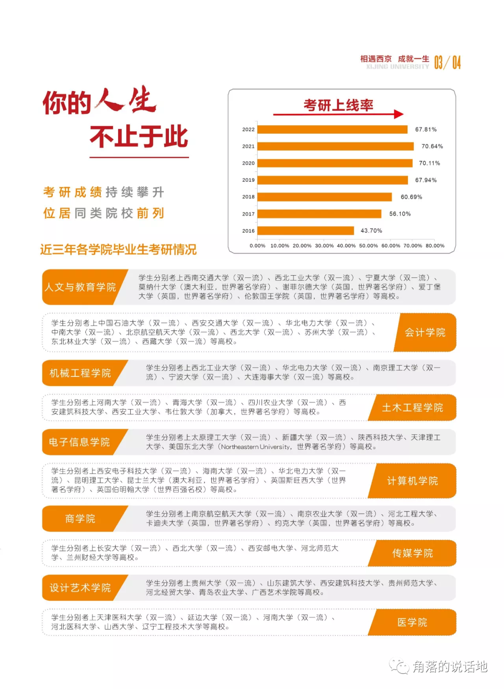

2022年7月22日晚上9：11分，我还在看着韩顺平的MySQL的教程，不过早已经是心不在焉，经常拿起手机或者不自觉地打开电脑浏览器看知乎，一天下来估计也就看完了3个小时的视频，然而这三个小时估计我看了快6个小时，还是开的1.5倍速，纵然我有在记笔记，却偷懒着没有一句一句去敲代码。总的来说我确实摸鱼很严重。废话有点多，总之类似今天的行为确实让我很丧气和焦虑，我真的确实不是那种非常自律和做一件事能够长时间专注的人。不过最近更令我焦虑的可能是我最近了解到的西京学院的信息，是的，就是我考上的那个民办三本的院校。为什么呢？

<!-- truncate -->

中考成绩出来的那时候可以说是我人生的高光时刻，我稍微超常发挥考上了我们区的最好的重点高中，却没想到，之后就一直在下坠，高中动了一些歪心思走了艺考想捡便宜去一个211，然后自己也能轻松一些，然而最后我去了一个北方省份的一个普通师范大学，甚至听说在江苏省是二本招生，但是谁又能想到我现在研究生又去了一个民办大学呢，哎，如果在我的高中的时候我会知道我会去这种听起来山寨感和野鸡感满满的类似于xx学院的民办大学，我估计怎么也不会接收去复读了。

所以在这种情况下，最令我产生自己很废物又很难受的时候其实并不是那些我身边的优秀的同学们，而是那些出生没有我好，却做出来连我都难以企及或者仰望的成绩。几年前去我婆婆家的时候路过了一个在农村旁边我们这非常差的中学，学校门口的横幅上写着恭喜我校xx同学取得384的高分（据我所知这是能去985的分数），最近我又被推送到一些关于西京学院的消息（主要是最近高考结束，很多高校都开始了招生宣传，而民办学校往往在这方面不得不说力度还是很大的，ps：我加的导师，计算机学院的院长竟然也好几次转发一些学校的招生和宣传视频），这些消息也毫无疑问宣传了本校的学生的优秀和本校的优秀，比如有一张宣传表格就列出了西京学院最近的考研上线率，和毕业生的学校，其中不乏C9，985，211，国外qs前100的学校，再者说就业我也看到不少毕业就去国家电网、字节跳动、阿里巴巴和华为的。

曾经我都看不上的那些学校，确确实实有人在那种环境中取得了很高的成就，甚至于是我梦寐以求的成就，而我现在也终于慢慢成了我之前看不起、瞧不上的那种人。

