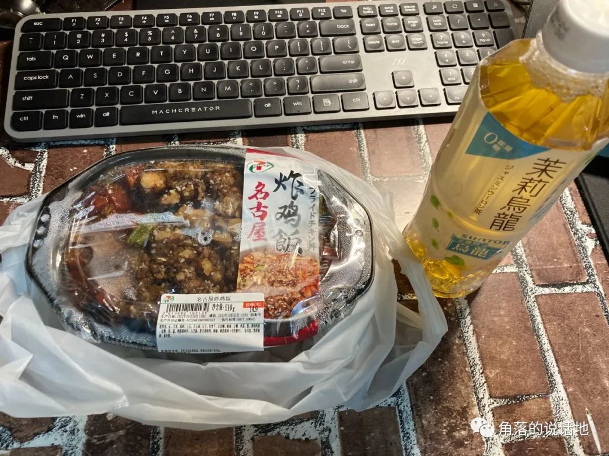

---

slug: After First Month In SJU
title: After First Month In SJU
authors: zhaozhiwen
tags: [life,XJU]
---

两年前的那段时间，从早到晚，我都不知道自己该做些什么，只会以一个观察者的角度站在一边，看着别人忙碌，然后一边浪费时间，一边逼迫着自己去思考未来，“迷茫”二字可以说就是我那时的状态，记得有一天晚上，我对lyf说，你知道吗，我感觉我像是一艘船，但却没有锚点，我的人生是一个缺失了主心骨的人生。

<!-- truncate -->

两年后的今天，回想起来，我依然觉得那时候是我短暂人生中最艰难的时刻，这种困难区别于行万里路才能到达终点，而是一种迷失方向停留在原地的困难。

如今两年的时光过去了，困难依旧重重，常常也会有干不下去了的想法，甚至有时候会反问自己：这两年自己到底收获了哪些成长？梦想的生活真的能到达吗？

横亘在我和“梦想的生活”之间的是能力的鸿沟。这句话不是我说的，是我朋友说的，它的含义是：“不是到不了，也没有人规定你一定要多少年才能做到，它只是问我，找对路了吗？又为此努力了多少分呢？”

2020的末尾，在荒诞的一瞬间，我做出了选择，无意地定性地回答了这个问题。而那之后以及现在往后我的最大的任务就是如何定量的回答这个问题。

封面是本科毕业前校园的最后一晚。如今学生时代的毕业日期又算是延长了两年半。

写于2022.10.06 

修改并发布于2022.10.16.

还继续往下翻吗？？

都是一些无聊琐碎的碎碎念捏~

来到西京学院引导的志愿者们，话说这个黄头发的学妹矮矮的是真可爱捏

还是最喜欢的麦当劳捏~

下车了捏~First glance XJU

图片来源于《我能有什么坏心思呢》

去码头整点薯条~

其实中国的商场都是大同小异捏，扬州、济南抑或是西安，进门总是熟悉的奈雪的茶、喜茶、然后就是卖衣服的优衣库

看起来很幸福捏~想起我本科那位总喜欢一个去超市的同学，难道不孤独吗？

熟悉而又陌生的711，三得利的乌龙又让我想起了往事了捏~怀念

试图尝试寻找往日的幸福~~

国庆一连下了一个多星期的雨，心情真是又好又坏

核酸的时候，看看天思考人生

千万不要把衣服放在最下面，尤其是在一楼。尤其一连下了一周的雨！！

.png)