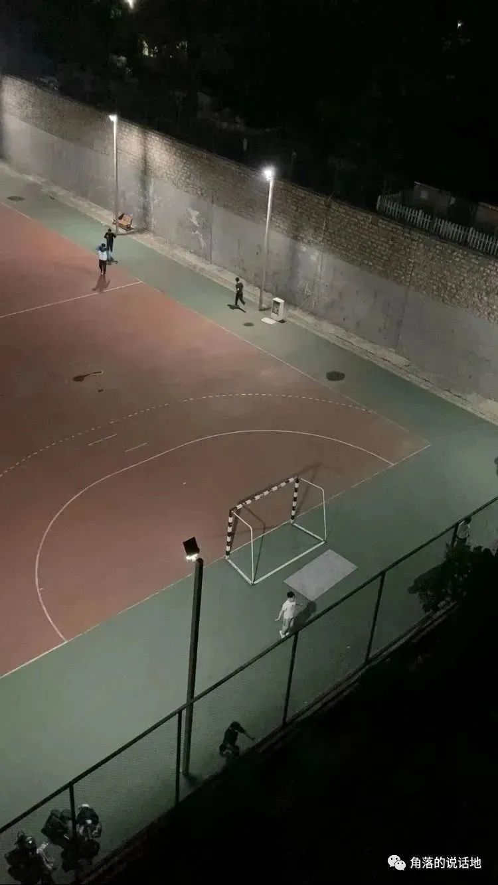
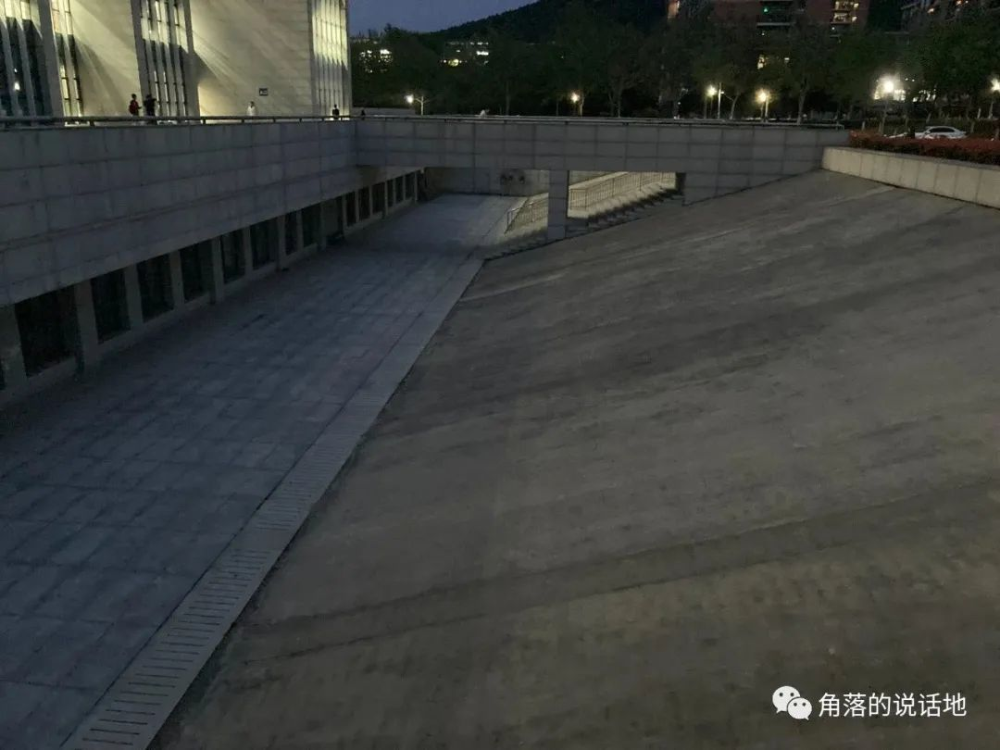
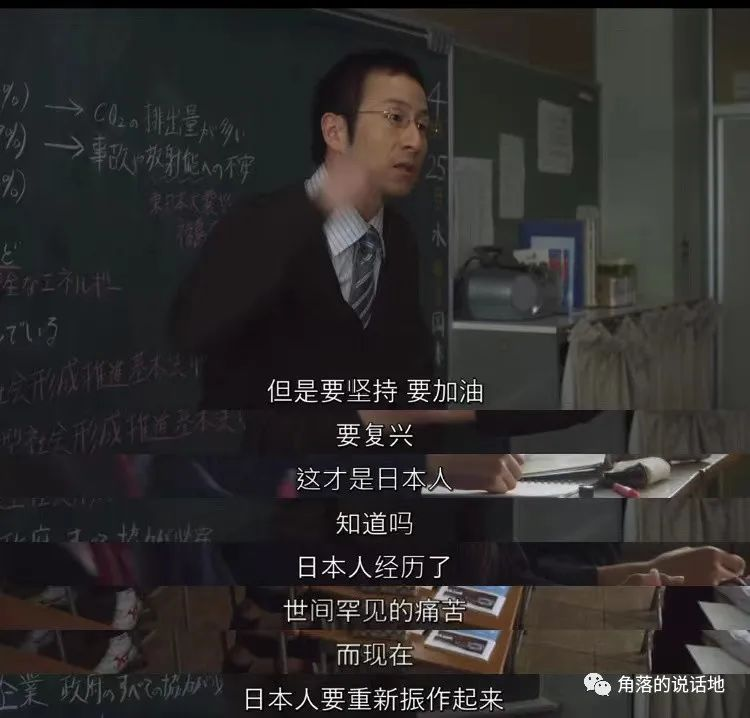
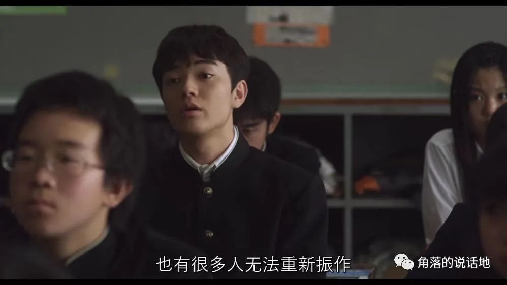
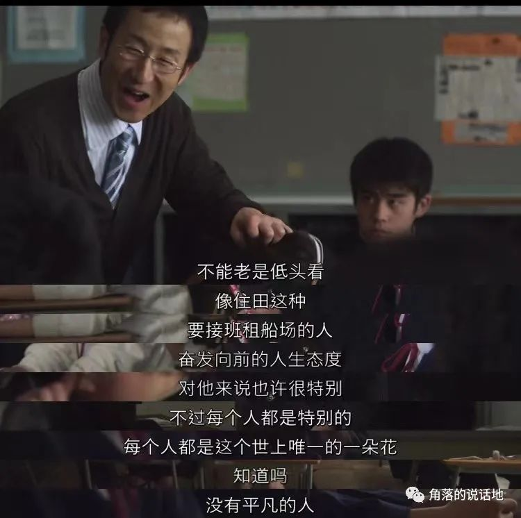
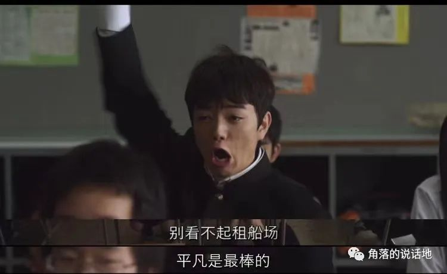
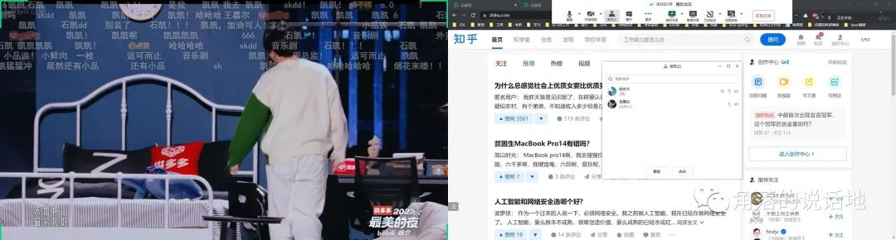
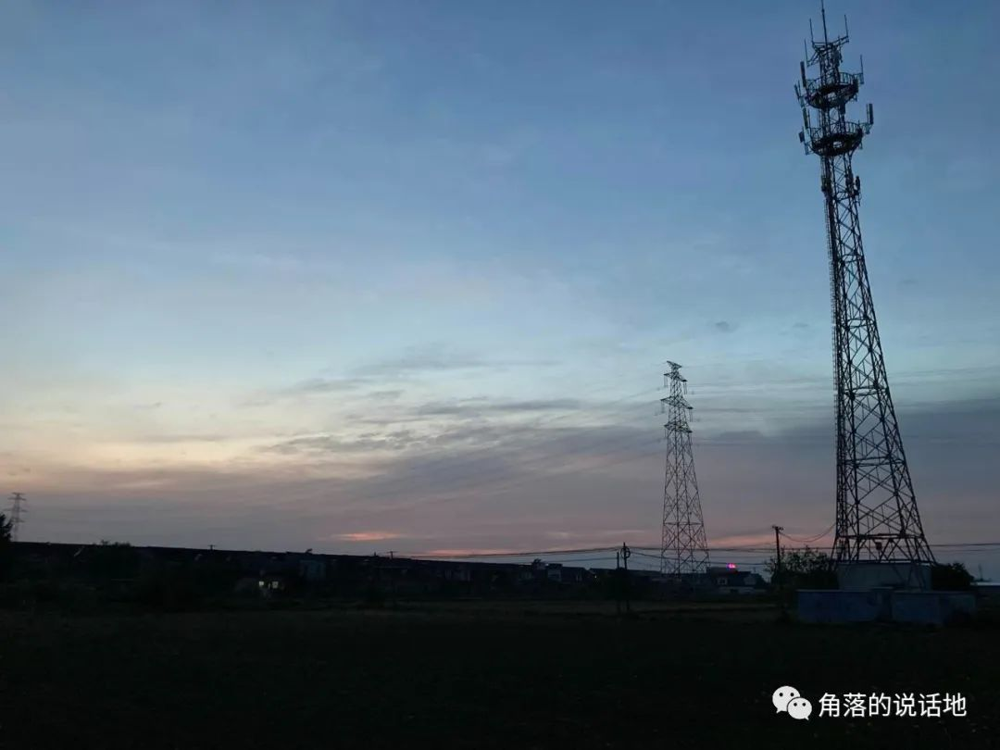

究竟该如何才能写出一个所谓的"年度总结"或者"年度报告"，我大概是完全不知道的，因为没怎么看过别人的，自己也从来没有写过，然而我心中却十分认同一个理念，这个理念并不是我发明的，是来自于我的一个大学同学，说出这个理念的背景大概已经忘记，只记得理念其本身的大意是这样的：当你第一次拍摄纪录片或者微电影的时候，很多时候你自然不知道怎么拍，这个时候你反而不需要感到焦虑和借鉴别人如何拍摄，仅仅需要发挥出属于自己的创造力和想象力即可，因为当你一旦看过别人如何拍摄，很大概率上，你的第一次有可能富有亮点的创造力和想象力就消失了，专属于你的第一次的独一无二的纪录片和微电影就消失了。我觉得这样的理念似乎引申到年度报告也是没有错误的。

<!-- truncate -->

***一、亲密关系与 "具体" 生活***

对我来说有一个事实，同学去实习工作、考研也结束时，进入2022我似乎真正成为了一个独立的个体，当然我还是在网络上有着和同学朋友的联系，但身边的所有亲密关系都同时间消失了，这是我完全不能适应的一点。

于是在大四上整个学期整个人都变得有些些无所是从，不知道该干些什么，感觉整个人的心中空落落的，于是在对我来说长达几个月的空白时间段，即使我努力地在给自己找事情做，可是那些一个人游荡在校园、楼道、阳台的时间越来越长。



<center>操场下的人们，摄于6楼阳台</center>

4月份的夜里，我站在6楼的阳台，看着楼下的操场，竟觉得有些不可思议，可是我又看的出神入迷，那个绕着篮球场跑了一圈又一圈的男生、穿着白色T恤跳绳的男生、在篮球网边做着健身动作的男生，一方面我总觉得或者说怀疑为什么会有人在大晚上一个人一圈又一圈地跑步和跳绳呢，这样子做的意义在哪里呢，这不是球类运动，可以说没什么乐趣可言，又不能帮助自己掌握一项能够赚钱养家的"硬技能"，能够让自己在社会上有一个立足之地，难道不是十足的浪费时间吗？于是在我疑惑并把疑问发给我的朋友们的时候，我得到了一个相当好笑的回答:"就是为了得到一个翘臀和奶子啊，这样子就可以吸引同性了"，我承认这个答案倒确实是让我一个人对着手机傻笑了30秒。不过话说回来，现在来看，对于当时的我，这些操场的人给我更多的是一个叫做"具体"的感觉，并且这个所谓"具体"是一种相对于"空虚"来说的。

如何进一步来做一个类比呢，最近刚好听到过"我要WhatYouNeed"一个播客，里面提到了一个概念叫做"**黄昏落日恐惧**"，意思大概是当你在下午困乏想睡一觉的时候，却发现一觉醒来的时候已经来到了黄昏，透过窗户看着那些鲜红的落日落入黑暗，内心好像就会产生出一个黑洞将附近的所有物质吸入，在这个过程中，人就像是跌入空虚与忧郁的宇宙之中，而这个时候往往将你从黑暗之中来出的，往往反而是妈妈的一句"吃饭了"和随之而来的锅碗瓢盆的声音。现在来看，怀疑着操场中的人们意义在哪是可笑的，请问吃饭又有什么意义呢？生活的意义不就在这些琐碎每天都要做的**具体的日常**中吗？

所以对我来说，当晚唯一让我感觉到意义的可能是当操场灯光突然熄灭，人群突然躁动的时候，我第一次知道了原来学校操场的灯光关闭时间是晚上10点。



<center>忍不住在晚上停留在图书馆的背面</center>

幸福的模式无法复制，于是2022年，我就像是经历了漫长的痛苦岁月，一个既失去了亲密关系也得不到幸福的人在距离毕业典礼还有一周的时间点提前逃回了家。

***二、平凡是一件要拼尽全力才可以做到的事情***

很喜欢园子温的电影《庸才》，下面是染谷将太所饰演的男主住田曾经说过的两句话:

<center>"如果每个人都可以梦想成真，岂不是天下大乱？"</center>

<center>"一只蟹每次生1万5千粒卵，如果每一粒都可以孵化的话，岂不是天下大乱？"</center>

<center>（注意：以下内容，包含剧透）</center>

对于住田来说，可以说算是出生在一个非常不幸的家庭，父亲离开或者说抛弃了家庭离去，母亲也只能住在湖边的一个用着破木板搭建的小房间里，连洗澡都只能捡来一个废弃的油桶当作洗浴的地方，然而更不幸的是母亲之后也随着一个不认识的大叔私奔了，父亲更是时不时殴打自己来和自己要钱，而住田也只能放弃学业，经营破租船观光厂（其实也就是小湖边几艘用来观光的破旧小船），而住田终其一生最大的梦想也只不过是过上一辈子守着租船厂的普通人的生活，可是生活中的连续打击终于致使住田毁灭了自己的生活，毁灭了自己的人生——在一天晚上，住田亲手结束了自己前来讨钱的父亲的生命。

住田确实做出了几乎毁灭自己的行为，然后意外的是，没想到连园子温也温情了一把，在最后时刻，住田在清晨和女主一起跑向了救赎的警察局，仍然希望着出狱后那梦寐以求的生活。

在整个电影中，我总是可以被剧情、台词和氛围深深吸引住，可是我不知道为什么，在电影之间和自己的生活之间总是存在着可能对我来说难以逾越的鸿沟，于是理解电影所想要传达的便是第一步的开始。而重要的一步就是理解所谓的"普通的生活"。

日本311地震，随之而来的海啸不仅造成了福岛核电站的泄露，也导致了无数人的家园被毁灭，到住田的中学老师在要人们振作起来的时候，可是住田说到并不是所有人都可以振作起来的,于是老师便开始了对住田即将接受租船厂，过上自己所谓的平凡的一生的嘲笑。









那位日本老师当然是无法了解住田的，受到虐待的"自己"，抛弃家庭的父亲，私奔离开"自己"的母亲，上门讨债的黑社会，被海啸卷走的房子.....这些一切的一切，当每一件事情渐次发生的时候，到底是谁有资格能够在讲堂上露出笑容说着所谓的那些慷慨激昂的"大家要振作起来"的话语呢？

不过确实有一点:那个抬起手臂，握紧拳头挥向天空、吼出平凡最棒的的住田确是一个实实在在的不平凡的人，这里不平凡当然不是说住田有多么超越普通人，恰恰相反，住田是太过落后于普通人了，仅仅生存下去，当一个普通人，对于住田来说难道不是已经是**要拼尽全力了吗。**

可是住田难道就真的甘心如此沦于平凡吗，即使平凡已是一种拼尽全力所要做的事情？难道所谓的梦想也真的不曾向往吗？于是住田也当然会在当别人向他谈论着所谓的梦想时感到怀疑、愤懑、忧伤可又无法改变。

<center>"追求理想的人才是正确，没有理想的人就是不行这是世俗的眼光吧？不会吧？"</center>

<center>"我不会是因为自己没有什么远大理想而嫉妒别人吧？......一定不是"</center>

实际上，在2022年的最后一天，写到这里的时候，我才终于明白了一个道理，明白了从考完研的2022年的冬天后很久让我终日不可遑遑的原因。这也是我想我在2022年末尾要记住的最重要的东西之一：

<center>"喂......你没有其他想法吗？...例如希望成名，希望自己很有钱...这都是一般年轻人的想法吧！"</center>

<center>"没有"</center>

我当然可能做不到向住田这样"没有"的回答，我也想要钱，我也想要有名，我只是一个普通的年轻人罢了，想要的东西也很多人一样，大厂所带给我的很大可能很大部分也是如此，我可能也总是痴心妄想着所谓的梦想，但是有时候对很多人可能包括我来说，难道不是"平凡已经是一件需要拼劲全力的事情了呢？"，难道这样不也是很好吗？

住田自首后会被判刑，十几年后，可以可以和茶泽景子结婚，生下几个孩子，然后经营下去祖传厂一辈子，这难道不是很好吗？

去大城市当上一个中小公司的程序员，这对于过去的我何尝不是一种梦寐以求的平凡呢？

最后，和yyg、yww一起看bilibili跨年的纪念照，再见了2022。



```c++
#include<stdio.h>
int main()
{
  printf("GoodBye 2022\n");
  printf("Hello 2023");
  return 0;
}
```

