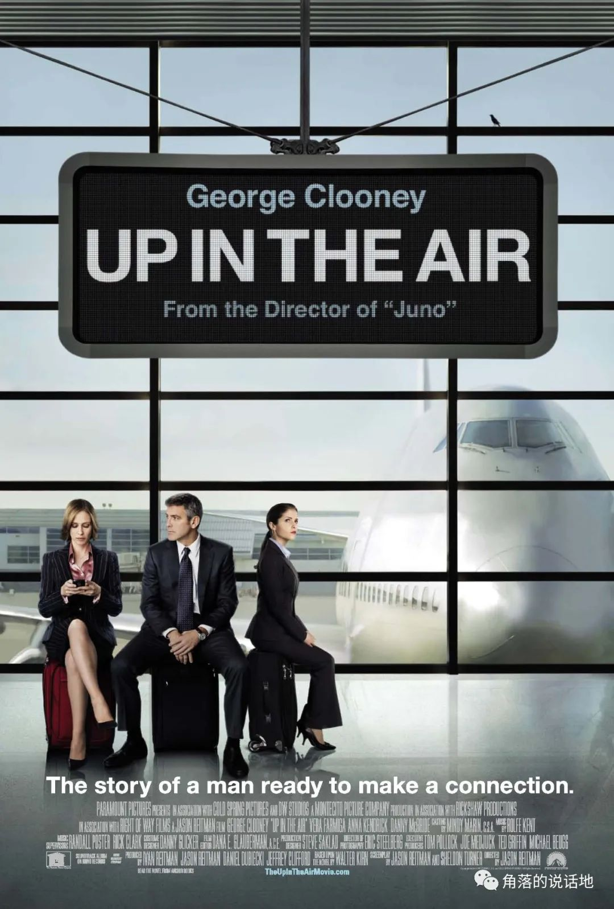

<iframe
  frameborder="no"
  border="0"
  marginwidth="0"
  marginheight="0"
  width="330"
  height="86"
  src="https://music.163.com/outchain/player?type=2&id=499465978&auto=0&height=66&mobile=0"
  style={{ display: 'block', margin: '0 auto' }}
/>

"昨晚我躺在床上一直无法入眠，所以我开始想婚礼，想仪式，想到我们要买房子，共同生活，生一个又一个的孩子，圣诞节，感恩节，春节，带孩子看橄榄球比赛，转眼孩子们毕业了，他们找到工作，然后结婚，我成了祖父，接着就退休了，开始脱发、发福，再然后就像你想到的，我就死了。我忍不住这么想，一切的意义是什么？生活的意义在哪里？"

"意义吗？"

"是呀，我到底在做什么呢？"

<!-- truncate -->

作为裁员专家，Ryan每次裁员时当然总是得心应手，因为Ryan内心清楚地知道所谓裁员工作的要领所在。

裁员工作的核心是什么？是帮助刚刚被解雇的人面对再次求职的难关？是减少被诉讼的几率？

是也不是，在Ryan心中，这些只不过是对外所宣称而已，实际上，这份工作的本质是缓解人们的痛苦，"普渡那些受伤的灵魂渡过恐惧之河直到希望的光芒隐约可见"。

是的，是"然后停下船，推他们下水自己游过去"。

裁员专家这份工作在我眼里是一种新奇（至少我是第一次听说）、更是一种对Ryan安排精巧的职业，在我看来，这份职业不仅很好的塑造并且解释了长此以往Ryan的人格和世界，在某种程度上更是对Ryan的一针麻醉剂和强心针。

从Ryan的角度来看，Ryan虽然也是资本主义世界中受雇于人的"卑微打工人"，但是本身职业就是解雇他人这一点的特殊性在某种程度上掩盖或者反转了Ryan的身份，从Ryan的推荐信中，我们是可以知道，Ryan在其大半个职业生涯中可以说是解雇了无数的人，而这些人被解雇者的身份在与Ryan的对比中似乎形成了极大的反差。

谈判桌的一边是Ryan，一个在公司被器重、能力出色的"老员工"，一个人到中年依然没有结婚买房有着富足金钱的"钻石王老五"，一个在旅程中时常有着艳遇追逐着所谓的"1000万英里"飞行里程勋章的"梦想男孩"，一个在各地进行"背包"演讲，向人们鼓吹"逃避责任"及时行乐的"精神导师"。

而另一边呢？他们是谁呢？是因为被解雇失去收入来源而付不起房贷的人们，是失去收入来源而无法面对家人的人们，是付出了整个青春现在早已垂垂老矣的老年人。

无论被解雇的一方是何种背景，Ryan似乎看起来总是站在人生胜利天平的一方，而对面那些人不过是经受挫折一些失败者罢了。

Ryan是真的相信自己的每一次演讲吗？是的，他是真的相信，每一次的演讲当他拿出自己的背包，说出自己的背包理论的时候，他自己和台下的人们都是在全然接受这个理论。在Ryan的人生中，始终贯穿着一种名为"轻"的人生价值观，这份"轻"就体现在最少程度的去考虑自己的家人，对于家人，Ryan几乎是一个不存在的家人，这份"轻"就体现在Ryan在和公司新人谈及婚姻和爱情时表现出的轻蔑和嘲笑，这份"轻"就体现在面对被裁员的众生所烦恼的房子、家庭、生存等难以生存的问题，Ryan可以在安抚他人的同时不存在这些问题保有内心最大的安全感。

也许这样的人生可以一直持续下去，已经这样安然度过了人生四五十个年头，难道还差剩下来的一二十年吗？可是Natalie和Alex毁了这一切，前者是公司的裁员新人，而后者是Ryan的艳遇对象。

为了男友，Natalie选择了Ryan这家裁员公司，选择了并不是最好的那一份offer，于是Natalie失恋后，发现自己所一直追求的全部幻灭，Natalie充满着失望、愤怒。于是当Natalie和Ryan共同站在海边时，Natalie看着Ryan，嘶吼和质问到为什么Ryan可以做到对和Alex的关系毫不在乎，并且告诉Ryan他的荒谬世界观的本质不过是在"逃避和放纵自己"，而他所谓的"独身和修行"不过是一种自我隔断于世界的借口罢了。于是在被一个二十来岁的女生教训一通后，Ryan只能无言而又尴尬的站在码头上，嘴里想辩驳些什么可是又说不出话。

在那一刻，我会认为，Ryan第一次意识到了自己的"迷路状态"，Ryan的世界观在和Natalie的争吵中发生了巨大的改变。于是也才有了文章头面对妹妹的结婚对象的灵魂追问，Ryan说出了自己曾经从不相信的话语，承认了自己的孤独，凸显出婚姻和陪伴的重要意义。

当然，电影的结局是悲惨的，当Ryan抛弃了自己过去的价值观，认为发现人生真谛，去到Alex家中时却意外的发现对方是一个有着家庭只把Ryan当作生活插曲的人罢了。于是，在黯然离开的同时，Ryan又踏上云端旅程，更多了一份迷茫与孤独。

写到这里，我突然联想到村上春树《没有女人的男人们》这部短篇小说集，这部电影的气质和苦咖啡式的结局颇有村上小说的调性，放进去应该不会过于突兀。不同的一点可能就在于这部电影的内核多多少少还是包含着些许温情以及所谓的美国"正能量"。

