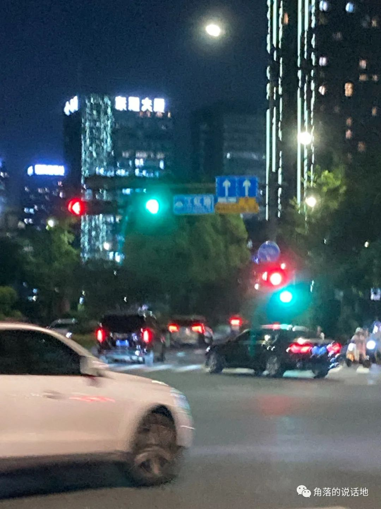

"老师我觉得这没有意义"

"这对我找工作也没有用"

"在课上，不能做自己的事情我感觉很难受"

2022年11月23日，周三，上午的第四节英语课，一个似乎对我来说平平无奇的上午，一个对我来说似乎平平无奇的课，可当我在课堂上，面对着英语老师，这些话从嘴里蹦出来的时候，我意识到我在我认为的波澜不惊且枯燥的生活中，我并不是平静的，我的内心反而更像是一个起伏着伴随着海浪的海面。

<!-- truncate -->

**关于时间**

人一旦失去过某些东西大概就会对一些东西特别敏感，大学四年中，当我意识到我已经浪费两三年的光景时，我已经大三了，于是在懊悔于无奈之中只能逐渐接受这个事实。所以在如今只有找工作这一个目的的情况下，我对所有课程的兴趣骤然减少，几乎都在自学，害怕浪费时间，想象着如果我在课程上多投入1秒钟，找到理想工作的概率就会减少一分。

于是在临近数学期末考试的时候，虽然我和他人一样害怕挂科，但是别人都在疯狂的临时抱佛脚准备期末考试的时候，我却失去了所有的动力，甚至连临时抱佛脚也不愿意，考试前一天的晚上甚至都还在学Java，归根到底我还是太过焦虑了，并且引发出来另一个担忧，如果我甚至都不愿意花上几天通过期末考试，我还如何面对今后很有可能将要花上半年写出毕业论文只为了这一个学历这一件事情。

所以在上英语课的时候，当英语老师提出每节课都要在课上练字并且要收上去的时候。我是怎么如何也无法接受的，于是草草写了几页，果不其然被批评了。于是无法控制的情绪爆发了。

**关于平凡**

我其实不是一个很相信类似于MBTI性格测试的人，记得聊天时朋友问起关于我的mbti性格，我当时说:"这东西好不准啊，也就图一个乐，竟然给我测出来ISFP探险家"，不过当时朋友的一句话我印象深刻："从艺术考研到计算机，这可不就是探险家吗"，是啊，我竟也觉得有些道理。

如今距离做出决定已经过去了快两年，现在的我更愿意把当初的决定定义为一个"最不平凡的平凡的决定"，看起来很矛盾，但是人不就是充满矛盾体的动物。一方面，从艺术专业考研到计算机专业，从零开始学数学、C语言、数据结构并且考到第一这件事情，我可以解读为一个用时间去创造奇迹、追寻梦想、不甘平凡的故事。可是另一方面说，我选择了一个远比我的本科学校差得多、过线就要的学校，我也可以解读为是一个没有梦想、甘于平庸的故事。

于是关于平凡与不平凡的矛盾便继续延续到我的研究生生活中，交织并且缠绕着。

在联系导师被接连拒绝的时候，一方面我绝望地告诉自己，自己没那么优秀，认清现实就好，另一方面却又充满愤懑。

在自己主动和别人进行比较和评价的时候，一方面我安慰自己：别人大学比我多学了好几年，我凭什么赶上他们，难道别人会停在那里白等着你吗，达到平均水平已是幸运，就不要还想着超出大多数了。另一方面却又不甘心于此。

