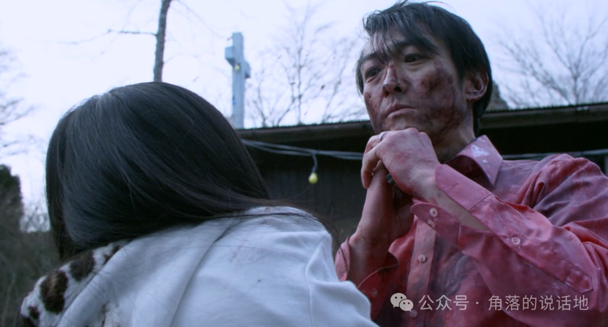

<iframe
  frameborder="no"
  border="0"
  marginwidth="0"
  marginheight="0"
  width="330"
  height="86"
  src="https://music.163.com/outchain/player?type=2&id=1890689298&auto=0&height=66&mobile=0"
  style={{ display: 'block', margin: '0 auto' }}
/>
**一、糟糕的开头**

回想起来，在整个大学本科期间，每逢清明、五一、国庆等假期，我从来都没有回过家，一方面当然是因为路途遥远，但另一方面总是觉得回家没有什么意思，能干些什么呢？去单纯见见家里的父母吗？甚至觉得别人都回家我一个人在宿舍随便干些什么都是极好的。

2024年的清明，在我人生25岁时，我第一次在清明节回了家。理由很简单，就是回家见见父母，至于别的原因也是有的，可是那种感觉很难表达，像是在杭州、上海、合肥、西安各种不同的城市，365天，每天走在街道上擦肩而过100个陌生人，终于在有一天独自躺在床上难以入睡时，我想起来要提前预订回家的车票。

<!-- truncate -->

周三工作下班已经是8点，又一次熬夜到夜里两点钟，这似乎成为了一种常态，周四早上的7点便早早起来，一边刷着手机一边思考着要带什么东西回去，8点出发，9点达到上海站，11点达到扬州东站，13点终于回到了家，期间经历了地铁、高铁、公交、打车共计5个小时的路程。也许之前的周末都几乎在出租屋休息，我第一次感受到巨大的疲惫。于是在家的母亲迎来的首先是我无尽的抱怨：

“虽然高铁只有两个小时，但是和高铁站之间的来回足足有3小时！”

“我好后悔，我是闲得没事吗”

“我好累，好想睡觉，昨天又是两点睡的”

“在家也没有事情干，还浪费钱，早知道不回来了”

“好想早点回去”

现在似乎意识到，我其实是一个消极的人，一个爱抱怨的人，在陌生人面前往往表现得沉默，可是面对亲人与朋友总是不掩饰悲观与负面情绪。也许在无形中这也是一种伤害。但我无法tough到独自承受，却也无法成为一个乐天派，但是说回来还是更想be tough。

**二、“生活就是痛苦”**

在电影《冰冷热带鱼》的结尾，暴走的社本，面对着赶来的家人，面对自己所犯下的无可挽回的罪行，冲向自己的妻女，拿着刀具发疯似的捅向了他们的腹部。

社本：光子，你能照顾自己吗？

社本：你想自己独立？

社本：痛吗？

光子：（嗷嚎着）你弄伤我了！

社本：痛吗？

社本：你想不想活？

光子：是，我想活下去！

社本：很好，你想活下去

光子：我不喜欢痛

社本：光子

社本：生活就是

社本：痛苦

社本：过自己的生活

社本：很痛苦

当你记住某一句话的时候，其实这句话在你心中已经埋藏了很久。虽然是很久之前看的这部电影，可是上面一段对话却给了我深深的震撼，他是如此的直白，却也是如此的有力，跨过漫长的压抑与沉沦，迈向爆发与毁灭，直到最后的高潮。

现在想来，往往能给我带来名为“震撼”感觉的影视，往往偏向于两个极端，一方名为“理想乌托邦”，一方名为“残酷毁灭物语”。而后者总是能给你带来毁灭的无尽快感，与所谓“尘埃落定、命运有数”的安心感。现实生活的大部分，快乐的时间总是少数，生存压力下的挣扎、孤独时的寂寞无援、迷茫漂泊时的焦虑与沉沦，每一个都是难以应对的事物。而当你面对着银幕上的这“残酷毁灭物语”，让大脑与身体沉静于其中，经历这长达两小时的高强度压抑与爆发，好像自己也经历其中，将主角投射于自身，像是在白天醒着时做了一场噩梦，直到最后的嘶吼，噩梦结束，可你却再也不愿醒过来。

不知什么原因，平日里主动和母亲的联系总是很少，总觉得她是一个活得比较简单的农村妇女，平日里总是可以获得很简单的快乐：今天买了一个新地毯、买了新的海棠花盆栽、一个人对着全民k歌唱了半小时，看着评论笑嘻嘻、抄抄喜欢的日文歌词、在灯光下做手工、一个人玩着我小时候才玩的蛇板窜来窜去，有时候我总会讨厌，讨厌她太幼稚、讨厌她不像个大人，可有时也能发现她一个人对着手机和陌生人聊天缓解孤独的一面，而那时我不懂，总认为很奇怪，而且在当自己也有了同样的经历后，多了一份可伶和不忍，而我能做的也只是呆在她的身旁转悠，做不了什么，可就是多呆在她的身边。

4月5日的一晚，不知什么机缘巧合，来到母亲的房间，不清楚什么缘由，白天没有察觉到什么异样的母亲，突然在床上和我说起了自己这三个月的经历.....而这也是她第一次愿意主动向我说起心事。

不知是什么原因，大概率是因为生存的压力，母亲突然找起了工作，工作地点在家附近的服务区当水果店的服务员，为高速下来的车辆服务，说是服务员，其实也兼任收银员与小吃制作的工作，每天的工作高达13个小时，在春节期间，甚至连大年初一也不得不上班，工作时间更是超过了15小时，然而最令人心痛的更是那15快一小时的工资。（包括夜里一点的加班）

在此期间，我和父亲两人虽然也关心母亲，给她经常预留夜宵，可她总是经常简单说了句“好累”而已结束，在我看来不可思议的工作强度，可在她却像一个没事人一样，我没有进一步多想，只是劝阻不要继续干了。

可今晚，她却将这三个月背后所经历的一切忍不住像洪水似的突然和我倾诉了一两个小时：“克扣工资”，“拒绝五险一金，永远把你当临时工”，“给你安排繁重的活，让和店长有关系的人干轻松活”，“被抓着衣领当众羞辱和辱骂”、“夜里和你打上几十个视频电话”，“被迫干对不起顾客的活，售卖烂水果和发霉的银耳汤”，“每天大声喊着香香的玉米来了的类似招揽客人的话语，却被人叫做大喇叭”......直到最后辞职却依然感觉自己太冲动了还是想留下来多赚些钱。

很难想象这是一个快50岁的中年妇女所经历的一切，超长的工作时间，大量繁重的体力活，几乎没有的休息日，极其低廉的薪资，外加上受到的身边人的言语甚至身体的歧视与欺侮以及店长的克扣工资...

心疼与震惊的同时，心里却释然很多，相比于父辈我依然是幸运的开头，似乎我整日的痛苦好像不值一提，至少完全无法和我母亲这三个月的经历所相比，那又有什么意义终日哀叹呢？

写到此处，似乎又对《冰冷热带鱼》的代词有了更深刻的理解：“照顾自己”、“独立”、“想活”、“活着”可并不是那些看起来简单与轻飘的词语，它们的含义并不是简单“有个地方住，有钱买菜做饭吃生存下来，自己有份工作能赚钱就行”。

生活是一场无尽的痛苦，而出生在罗马的幸运儿们则是众人的羡慕对象，在人生的几十年中，在每一年的365天中，在每天的24小时中，你永远需要挣扎，自救必不可少，人生无岸而几近溺亡的时候总会时而来临。

第二天的母亲，依旧能开心地大笑，充满生命力，好像昨晚的事没有发生一样。

如果她想说：“I want to be strong”

那么答案一定是：“She is Strong”

**三、“有时候回到家看下父母并不是一件难事”**

因为有时候什么都不懂的他们也会关心起你的论文写得怎么样，尽管你从未认真地将生活中的事情告诉他们，也从未指望他们能够理解。

**“告诉你也没用”**

**“反正你也不懂”**

**it hurts**
